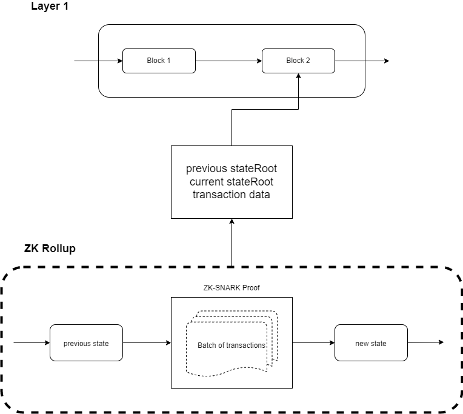

# ZKU - Assignment 4

    Email - stanleychiu@protonmail.com
    Discord - HKerStanley#4125
    GitHub - https://github.com/HKerStanley/zk-uni (./asset/week_4)

## Question 0: Which stream do you choose (answer with A or B)

I am going for Stream B to build ZK Dapps

## Question 1: Scaling the future

1. There are 4 different approaches for L2 solution to try to solve the scalability trilemma:

   1. State Channels: As most of the transactions moved off-chain, L1 blockchain will only act as a settlement layer which massively increase the amount of transactions that can be handle while keeping the cost low and fast. However, the channel cannot transact with people outside the channel, which limit the users from complex application. Also, opening such channel requires user to lock up liquidity, which if it scales it can be capital inefficient. Also participants need to actively monitor the network to ensure the fund is secure, which can cost inefficieny and complexity.

   2. Sidechains: Basically another blockchain that pegged to the L1 blockchain, it scales L1 blockchain by using a different consensus algorithm. However they typically made a trade-off in decentralization. And since they are independent blockchain and usually have their own security model, they can be less secure than the L1 blockchain for example Ethereum.

   3. Plasma: Plasma works very similar to a sidechain, but instead of an independent blockchain from L1 they are a series of smart contracts. Merkle Tree will be constructed from transactions and the root will be committed on L1 blockchain so that it still enjoys the security by the L1 blockchain. However, since an operator is needed for posting the merkle root to L1 blockchain, they will have the power to perform data availability attack that withhold transaction data. Lack of data can lead to acceptance of invalid blocks as there will be no way to prove the validity.

   4. Rollups: It works similar to Plasma but this time we also post the transaction data on-chain. The amount of data is keep as minimum amount required to locally validate the rollup transactions. Moving transactions to the rollup later and compress transaction data help to scale the L1 blockchain with same level of security. But since we are still posting data on-chain, the scalibility is limited. And since rollup is working on a different layer, it makes liquidity fractured and lose the composability when building on L1 blockchain.

2. ZK-Rollup follows the "Don’t trust, verify" mentality that it execute and validate transactions off-chain. It make sure the batch of transactions is correct and generate proof that can be used for verification. Both the proof and transaction data will be posted on chain so that anyone can verify the data if needed. The reason I am more lean on ZK rollup is about the latency. User experience is better as the withdrawal of assets is faster in ZK rollup, while in Optimistic rollup user need to wait for a "challenge period" if there are fraud proof. Also, since transactions are posted after verification, ZK rollup is more secure than other rollup.
   

3. Stateless client is a concept that allow nodes to validate a block without storing a full Ethereum state. Instead, the state which is required for validating a block is delivered as a witness. From here we can apply zero knowledge concept that such witness is used to verify the next state without the need of revealing/storing the previous state.

## Question 2: Roll the TX up

3. Major advantages of zkPorter is the exponential growing TPS and significant cost reduction. Also, in their Proof of Stake protocol, operators or guardians cannot steal fund but only freeze them, which is more secure. Generally speaking I think zkPorter is good for majority of users as speed and cost are their major concern. It is also providing an extra option to users when a transaction is not that sensitive to require best security. However, since zkPorter stores data off-chain and depends on validators' stake, it can be less secure compare to storing on-chain.

## Question 3: Recursive SNARK’s

## Question 4: Final Project Ideas

## Question 5: Thinking in ZK
